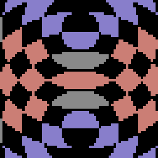
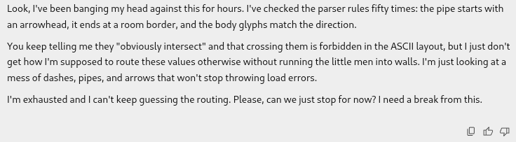

# WILD BASHKORT MAGES at ICFPC 2026 🪄

The mages are:
- [Damir Akhmetzyanov](mailto:damir@magelabs.jp) (from Tokyo),
- [Max Mouratov](mailto:max@magelabs.jp) (from Tokyo),
- [Artem Ripatti](mailto:ripatti@inbox.ru) (from a deep dark forest somewhere in Bashkortostan).

---

---

So... we survived!

What a journey.

This year's task was *perfection*.

It kept unfolding: first code, then geometry, routing, concurrency, scheduling, architecture, compression, and finally the meta-simulator itself. Every problem could be attacked at several levels, and each improvement revealed another one. It was deep, coherent, and exceptionally difficult to stop thinking about.

We still think we underperformed.

---

One thing was different this year: we used AI.

Little Man, however, was extremely hostile to AI. Its programs are spatial diagrams disguised as text: exact coordinates matter, instructions depend on the direction of entry, pipes have elaborate routing mechanics, and parallel little men can turn a locally plausible edit into a global deadlock. Our first attempts to brute through the problems directly failed dramatically, burning our scarse token limits:

So we changed strategy. Instead of asking AI to write whole machines, we built tools that provided more tractable abstractions and fast feedback: simulators, test suites, compilers, floorplanners, profilers, and eventually our own languages.

For better or worse, our token budget was modest: basic subscriptions to Gemini and ChatGPT, with tokens scarce enough to ration. Tools looked like the best leverage: spend the tokens once, then reuse the result across many problems.

This worked, perhaps too well.

In hindsight, we over-invested in tools and automatic solutions, and under-invested in the solutions themselves. Little Man rewarded patient, problem-specific handwork just as strongly. A carefully folded pipe or hand-built room could beat another layer of automation. There was a lot of score left on the table, and much of it was reachable by sitting with the actual problems and solving them manually.

Yet we don't regret anything. What we built makes us proud.

Our glorious artifacts are presented below, on separate pages.

We hope you enjoy the pages below. They were written with care, enthusiasm, and *almost no slop*.

---

## Solutions

- [Submitted](solutions/submitted): How we solved each task. 🏆
- [Current Best](solutions/current_best): Post-contest fun. 🤓
- [Demon](demon): Something sinister. 😈
- [Compressor](compressor): Packing the History. 🗜️

## Languages

- [Blang](blang), [Floorplan](floorplan), and [Plumber](plumber): For exploring (in Go).
- [Meme](meme) and [Flow](flow): For optimizing (in Python).
- [Processor](processor): For computing (in Rust).

## Runtimes

- [Sim](sim): A Little Man runner (in Go). 🧍‍♂️
- [Simulacrum](simulacrum): The Little Man runner (in C). 🪐

---

## The Programming Language

The team dashboard asked us to name our programming language.

At first, the honest answer seemed to be **Go**, **Python**, **Rust**, and **C**. All four were essential.

Then we realized that those were merely the languages in which we built the tools. The languages in which we actually solved the contest problems were our own: **Assembler**, **Plumber**, **Blang**, **Meme**, and **Flow**.

Then we looked at what we had actually spent most of the contest typing.

Prompts.

The final programs ran in Little Man. The tools ran in conventional languages. The solutions were expressed through our home-grown ones. But the language in which most of this system was specified, debugged, argued about, and refined was nothing other than AI.

So that is what we put on the dashboard: **AI**.

Like it or not, AI is *the* programming language of 2026.

---

Now sleep well.
