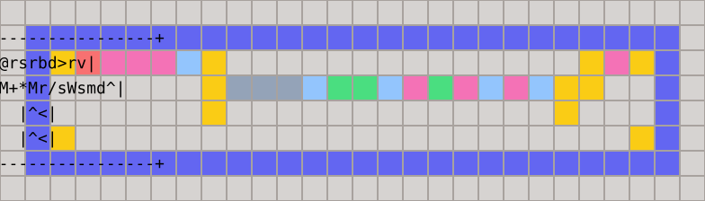

# Blang

Blang is a small structured language that compiles into [`.block`](../blocks) files consumed by `floorplan`.

Each program is compiled into a single block.

The language exposes the little man's `A` and `B` registers while reserving the backpack for loop control.


## Example

A block that decodes ASCII from a Radix-128 encoding:

```text
block packed_ascii_decoder

input rom auto
input state_in auto
output state_out auto
output bytes auto

forever {
  A = recv rom
  send state_out

  A = recv rom
  repeat A {
    A = 8
    B = A
    A += B
    A *= B
    B = A
    A = recv state_in
    A /= B
    send state_out
    swap
    send bytes
  }

  A = recv state_in
}

test one_word {
  input rom: 1106241 3
  loopback state_out: state_in
  expected bytes: 65 66 67
}

test two_words {
  input rom: 1106241 3 15608 2
  loopback state_out: state_in
  expected bytes: 65 66 67 120 121
}
```

Compilation result (see [full metadata](../blocks/packed_ascii_decoder.block)):




## Ports

A port is declared as one of:

```text
input NAME auto [MIN_LENGTH MAX_LENGTH]
output NAME auto [MIN_LENGTH MAX_LENGTH]
input NAME SIDE OFFSET MIN_LENGTH MAX_LENGTH
output NAME SIDE OFFSET MIN_LENGTH MAX_LENGTH
```

`SIDE` is `top`, `bottom`, `left`, or `right`.

Automatic placement assigns distinct wall positions and verifies every named send and receive against the machine's pipe assignment and reading-order rules.


## Statements

Supported operators:
```text
A = INTEGER
B = A
swap

A += B
A -= B
A *= B
A %= B
A /= B
A = -A
A &= B
A |= B
A ^= B
A <<= B
A >>= B

A = recv PORT
A = recv any
query PORT
send PORT
broadcast
broadcast PORT
broadcast all
decrement backpack
halt
nop
```

For compact generated code, `raw CODE` inserts a validated sequence of machine instructions directly:
```text
raw 7M*
```

`A = recv any` emits `R` and receives from whichever declared input has a value ready.

`query PORT` emits `q` and stores the number of occupied cells in the selected incoming pipe in the backpack.

`broadcast`, `broadcast PORT`, and `broadcast all` emit `S`, atomically sending `A` to every declared output. The named form also anchors port assignment to that output.

Loops use the backpack internally:
```text
repeat A {
  # runs max(A, 0) times
}
```

An existing backpack count can be consumed directly:
```text
repeat backpack {
  # runs while backpack > 0 and decrements it after each iteration
}
```

`decrement backpack` emits `m` for an additional explicit decrement.

Loops that derive their continuation condition from `A` do not use the backpack:
```text
while positive A {
  # tests A before entry and after every iteration
}
```

Sign control has three eastbound branches:
```text
if sign A {
  negative {
    A = -1
  }
  zero {
    A = 0
  }
  positive {
    A = 1
  }
}
```

The top-level `forever` block is required and becomes the room's persistent control loop.

Nested `repeat` statements are rejected because one backpack cannot hold two active counters.

Statements inside a sign branch may contain a repeat, and sign branches may be nested.


## Tests

Top-level `test` blocks attach executable examples to the generated `.block`:

```text
test smoke {
  input request: 1 2 3
  loopback state_out: state_in
  expected response: 2 4 6
}
```

`loopback` feeds values emitted by an output port back into the named input queue while the block test is running.


## How the compiler works

1. Each statement becomes a rectangular box.
2. Boxes are composed geometrically:
   - Sequences are joined left-to-right along their baselines.
   - `if sign` creates three vertically stacked lanes around an `X`.
   - `repeat` wraps its body in a backpack-controlled return loop.
   - `forever` adds the man (`@` ) and an outer feedback path.
3. Long top-level sequences may be folded into rows.
4. It is verified that every `r`, `s`, or `q` binds to its intended nearest pipe.
5. Four layouts are tried: folded or linear code, each with direct or separated port operations.
