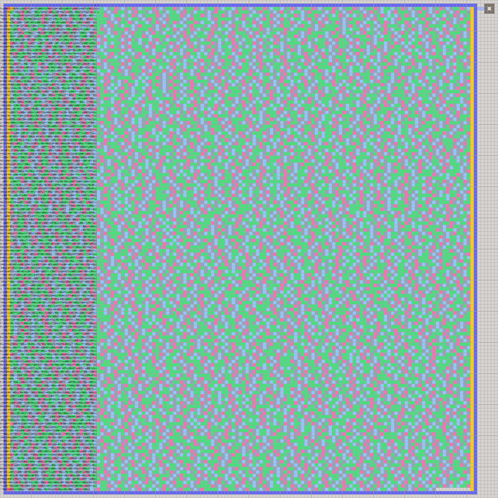
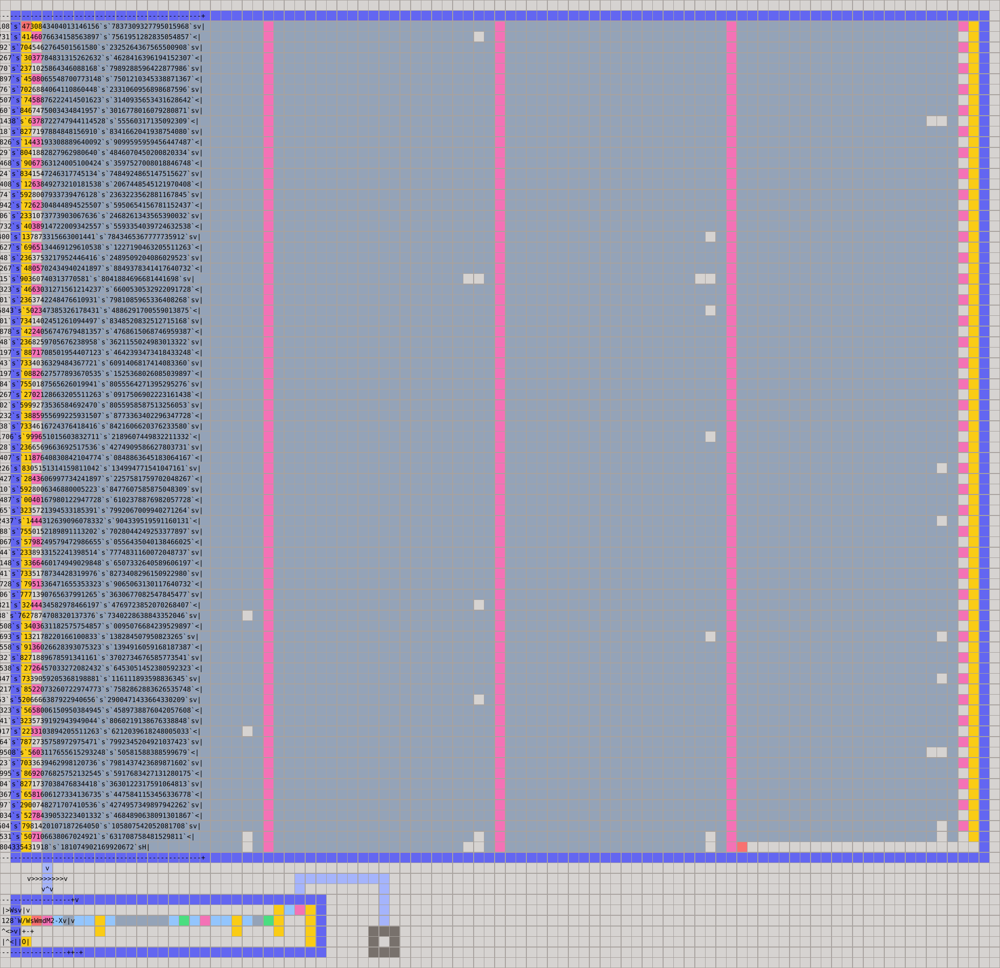
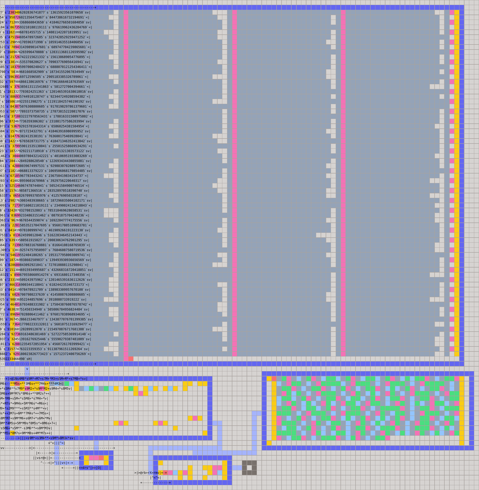
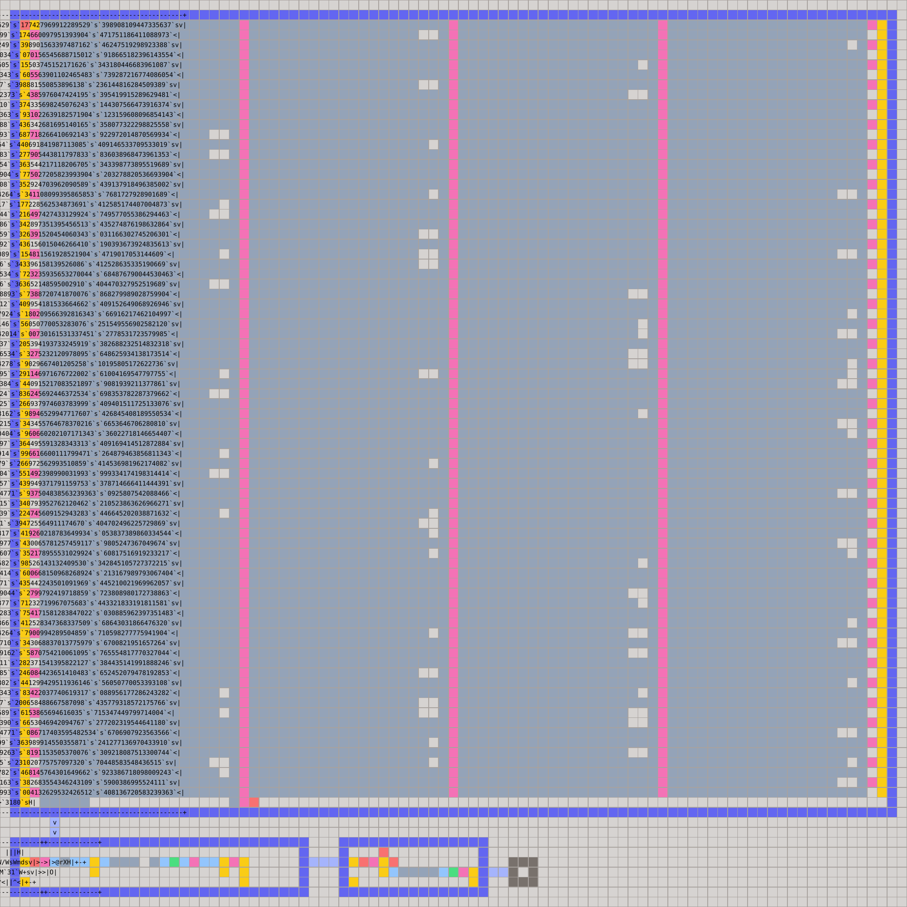
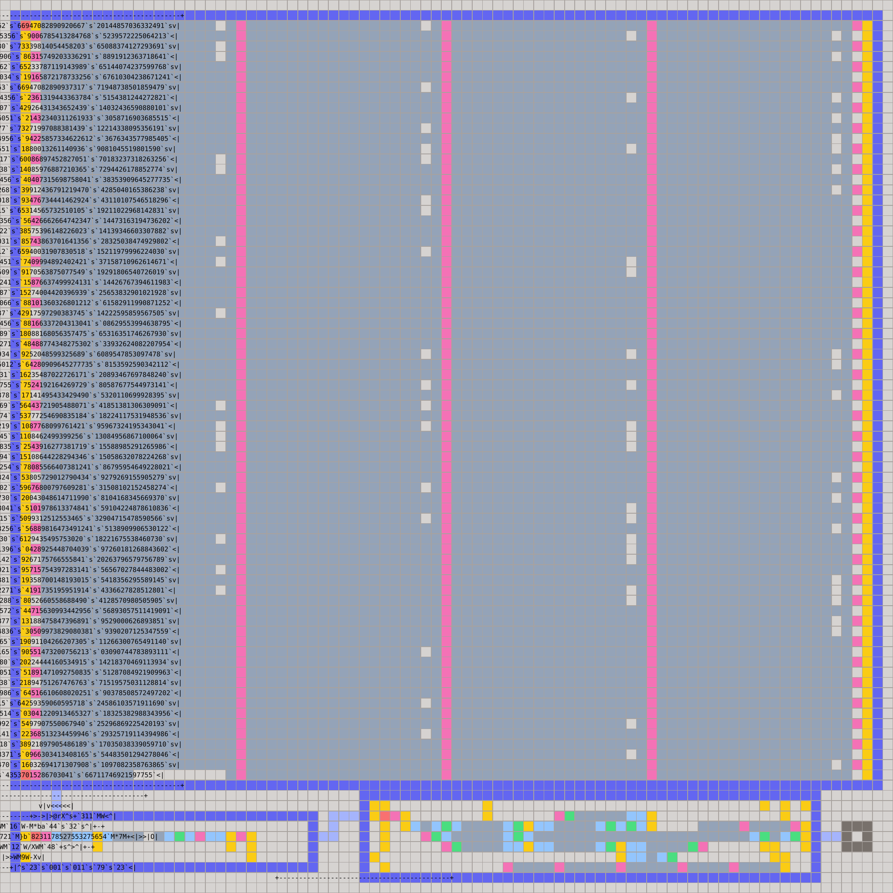
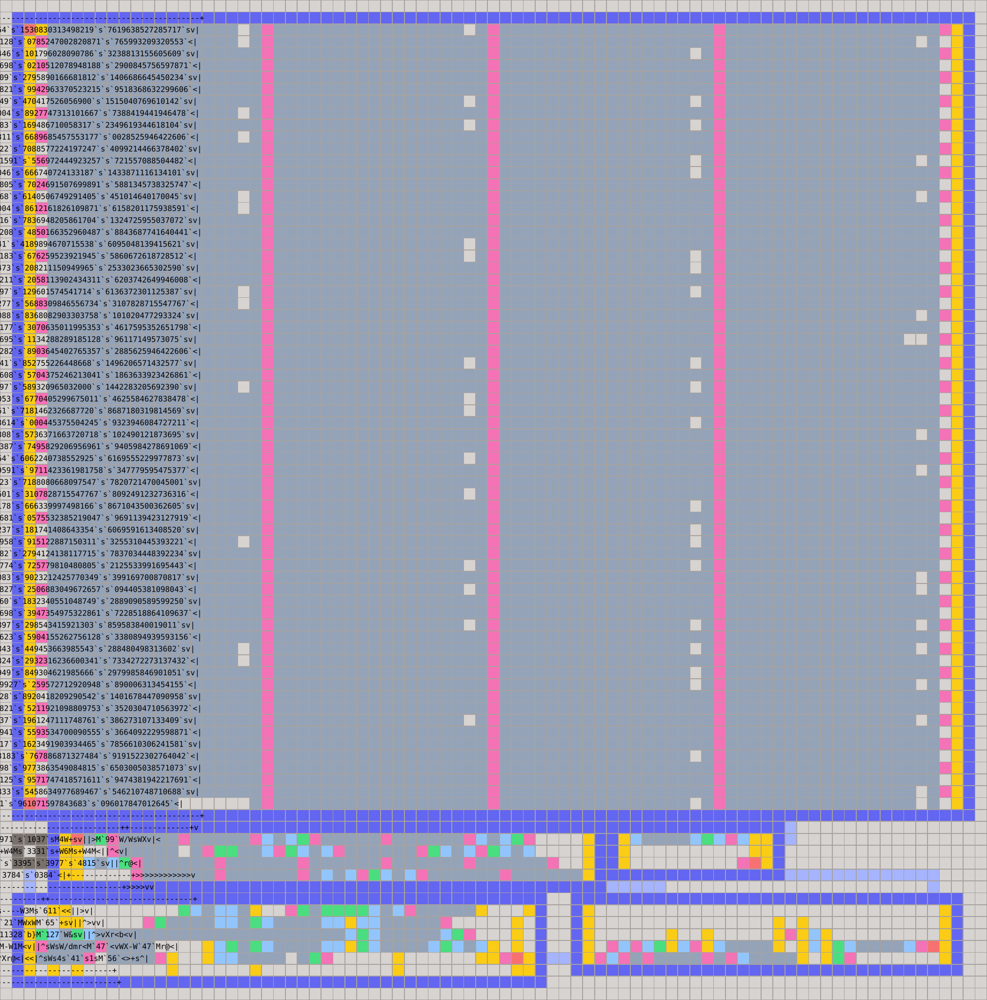
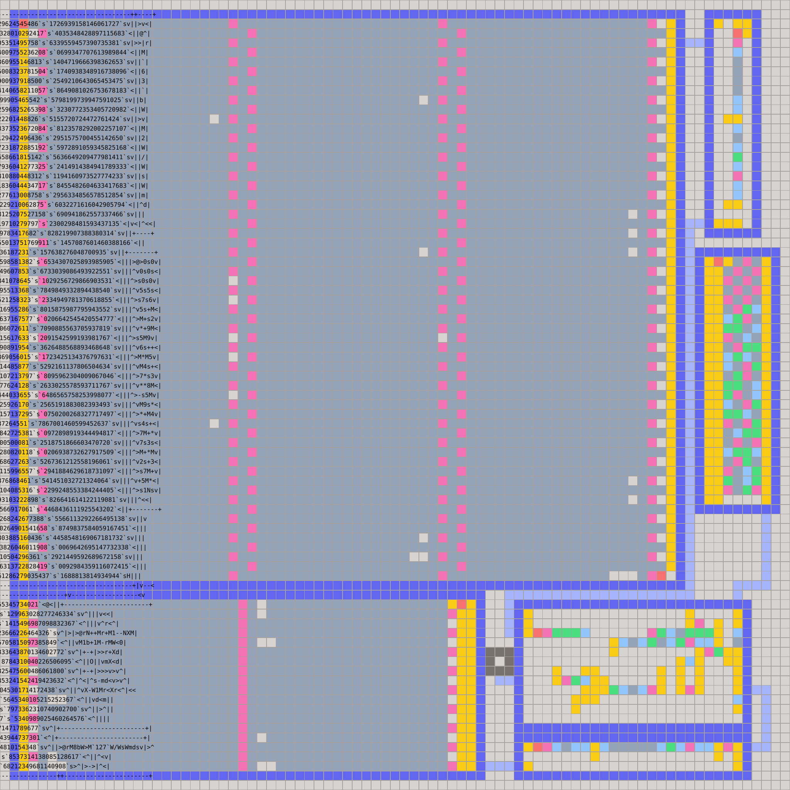

# Compressor

Compression experiments for **History Lesson**.

The tools generate both encoded data and the Little Man rooms that decode it.

## Results

| Codec                | Dimensions |
|----------------------|-----------:|
| Arithmetic synthesis |    142x142 |
| Packed ASCII         |      93x90 |
| Base-71              |      95x97 |
| Base-92              |      89x89 |
| Base-75              |      85x85 |
| Base-99              |      81x82 |
| Huffman*             |      81x81 |

*The Huffman layout needs less area, but it exceeded the contest step limit.

Base-99 was the smallest submitted codec.

## Algorithms

### Arithmetic synthesis

A breadth-first search over `(A, B)` states finds the shortest Little Man program that produces each required byte. The programs are joined and folded into the smallest near-square room. This needs no decoder, making it a useful baseline.

### Packed ASCII

Nine 7-bit slots fit in one 63-bit word. Words contain either nine characters or eight characters plus padding/EOF. Dynamic programming chooses eight- or nine-byte chunks while rejecting decimal values that overflow when read backwards. The ROM stores four 19-digit words per row.

### Base-71

Base-71 stores ten characters per word using the 71 symbols present in the text. A cyclic dictionary maps ranks back to ASCII.

### Base-92

Base-92 stores nine characters from ASCII 32 through 122. Decoding needs only division and an offset, with zero terminating the last word.

### Base-75

Base-75 gives arithmetic code ranges to letters and digits, with a tiny lookup for punctuation. The unused `q` code and one spare value encode `", "` and `" and "`.

### Learned Base-99

Base-99 combines structured ASCII codes, three fixed phrases, and 24 learned byte pairs.

Pairs are selected greedily. Each candidate is evaluated by dynamic programming to find the minimum token count obtainable with the current dictionary. A second dynamic program tokenizes the final text into literals, phrases, and digrams.

Word boundaries are optimized separately. Each word holds up to nine tokens while remaining below `10^16`. The decoder consists of a Radix unpacker, token dispatcher, cyclic pair table, and arithmetic ASCII mapper.

### Phrase-aware Huffman

The Huffman experiment mines repeated substrings, greedily chooses useful phrases, and jointly refines tokenization and Huffman code lengths:

1. Dynamic programming segments the text using current token costs.
2. Symbol frequencies produce new Huffman lengths.
3. Those lengths become the costs for the next segmentation pass.
4. Iteration stops when the token stream stabilizes.

The result uses canonical codes, an EOF symbol, and 63-bit bitstream words. Two decoders were explored: a generated decision trie and a compact pipeline using depth counts and a Radix-127 symbol table.

Huffman gives a smaller logical stream, but its tables and control logic demonstrate why conventional compression ratio is not the decisive metric here.

