# Demon 😈

These 64x64 demoscene effects were coded at the end of the contest as a stress test for the [Processor](../processor) and [Simulacrum](../simulacrum).

They exercise large-footprint programs, fixed-point arithmetic, heavy register traffic, RAM, display writes, and simulations lasting billions of ticks. Most effects implement fixed-point trigonometry using precomputed tables and interpolation.

Simulacrum renders most of them at more than 1 FPS which, by Little Man standards, is practically real time. Cough.

After the contest, we optimized both the effects and the tools, improving rendering speed by roughly 50%.

Most of the assembly code was translated from C prototypes by AI, with some human help.

The 16-color palette is from Commodore 64.

## XOR

Two moving radial distance fields collide and bloom into multicolor interference bands. Finite differences carry their squared distances across each scanline without providing them a single square root. Balanced threshold trees recover only the bits demanded by XOR; and even bands rotate through six colors while four periodic second-order oscillators quietly steer the two centers along opposing paths. Undrawn circles enter; colored bitwise patches leave. 🤯

**Area:** 114x108 | **First frame ticks:** 67,269,807 | [Assembly](xor.asm) | [Generated `.man`](xor.man)

[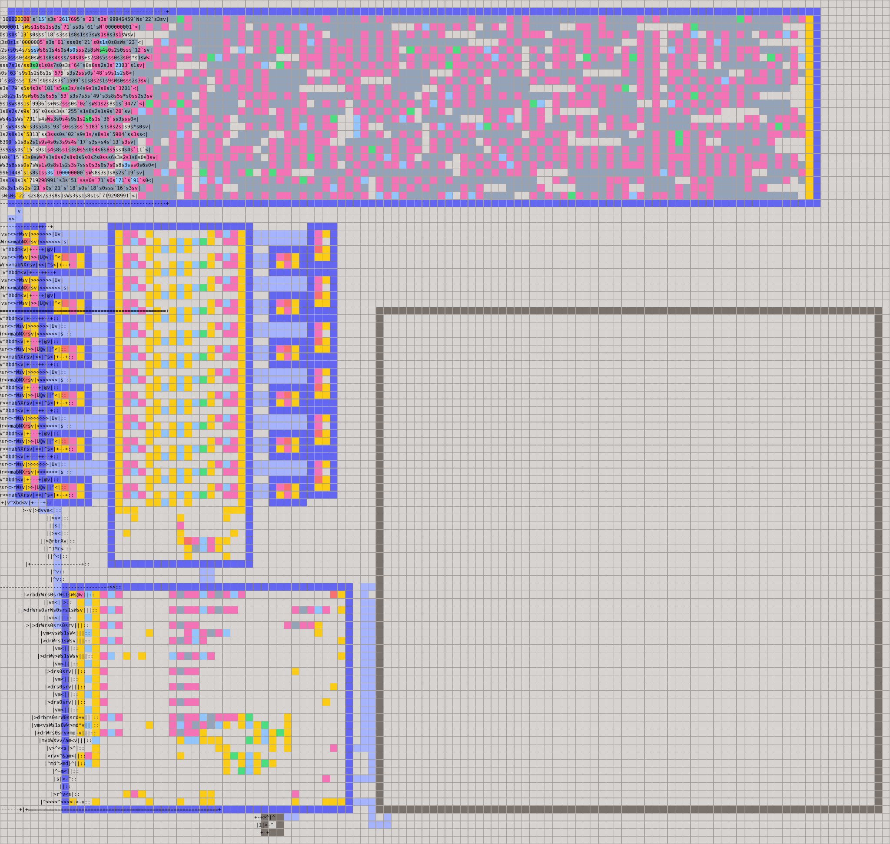](xor.man)

## Rotozoom

A fixed-point checkerboard rotates, zooms, and breathes without ever learning what an angle is. A compact quarter-wave sine table unfolds itself into a full rotation, a sinusoidal scale draws the texture nearer and farther away, and affine coordinates pull the entire plane beneath the pixels until multiplication begins impersonating a camera. 🤯

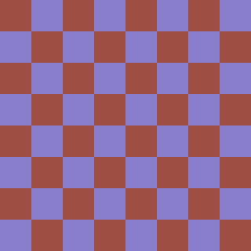

**Area:** 121x120 | **First frame ticks:** 49,573,415 | [Assembly](rotozoom.asm) | [Generated `.man`](rotozoom.man)

[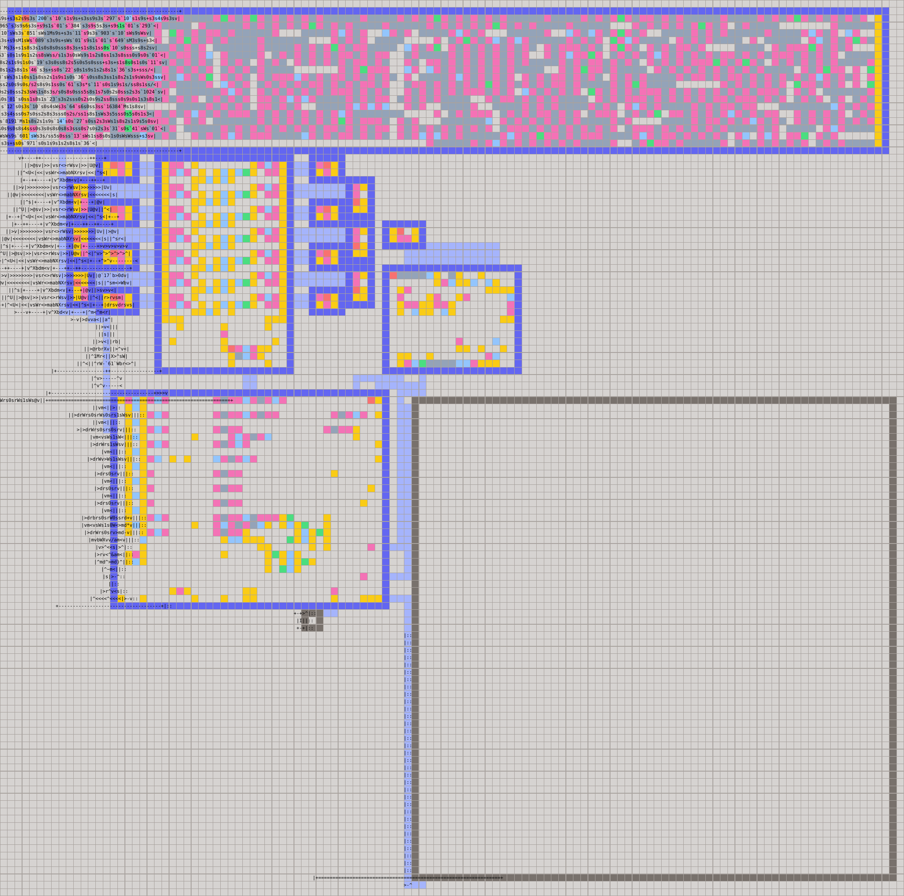](rotozoom.man)

## Cube

A perspective wireframe cube turns around two axes as its eight vertices pass through fixed-point camera space, submit to perspective division, and emerge reassembled as lines. Camera-space depth chooses the edge colors, and color lends depth back to the flat screen; one shared DDA loop stitches every segment together, leaving eight vertices to recall a dimension the screen cannot hold. 🤯

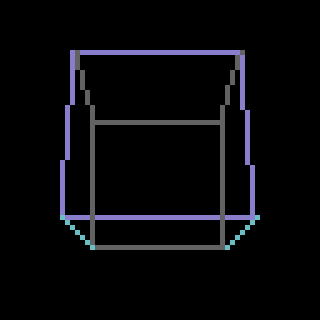

**Area:** 126x127 | **First frame ticks:** 33,061,941 | [Assembly](cube.asm) | [Generated `.man`](cube.man)

[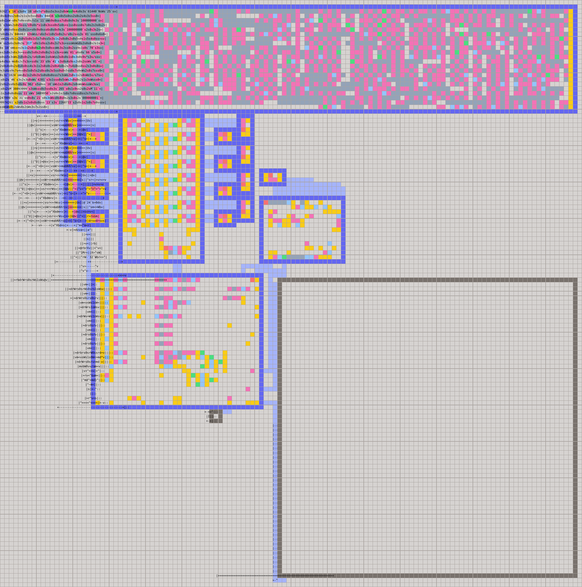](cube.man)

## Dodecahedron

A rotating perspective dodecahedron begins by gently demoting the golden ratio to an integer approximation, then asks twenty fixed-point vertices to recall an irrational solid. A packed edge table reunites them after projection, camera-space depth selects the palette, and thirty lines agree never to mention the missing precision. 🤯

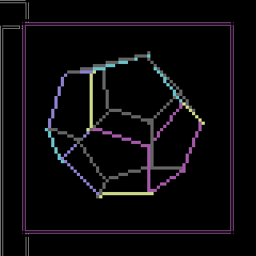

**Area:** 141x141 | **First frame ticks:** 58,944,403 | [Assembly](dodecahedron.asm) | [Generated `.man`](dodecahedron.man)

[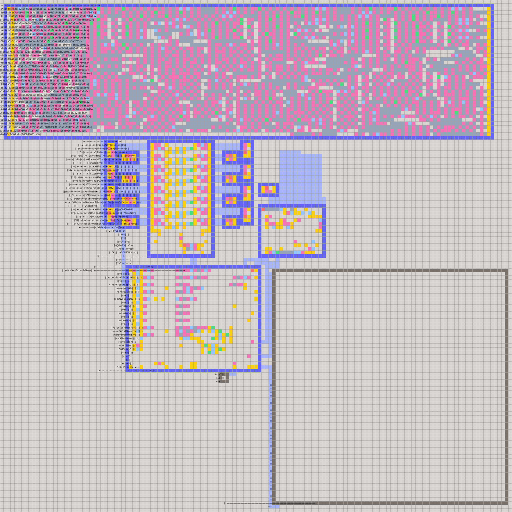](dodecahedron.man)

## Hypercube

A four-dimensional tesseract folds through four fixed-point plane rotations, pays one dimension to 4D perspective and another to ordinary 3D perspective, then arrives on a flat screen as though nothing unusual happened. Each edge carries one stable color from an eight-color palette throughout, as when the geometry is slipping between dimensions, the colors need at least one dependable truth. 🤯

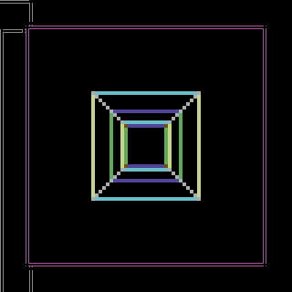

(this poor cube is in serious pain 🥲)

**Area:** 132x133 | **First frame ticks:** 55,466,908 | [Assembly](hypercube.asm) | [Generated `.man`](hypercube.man)

[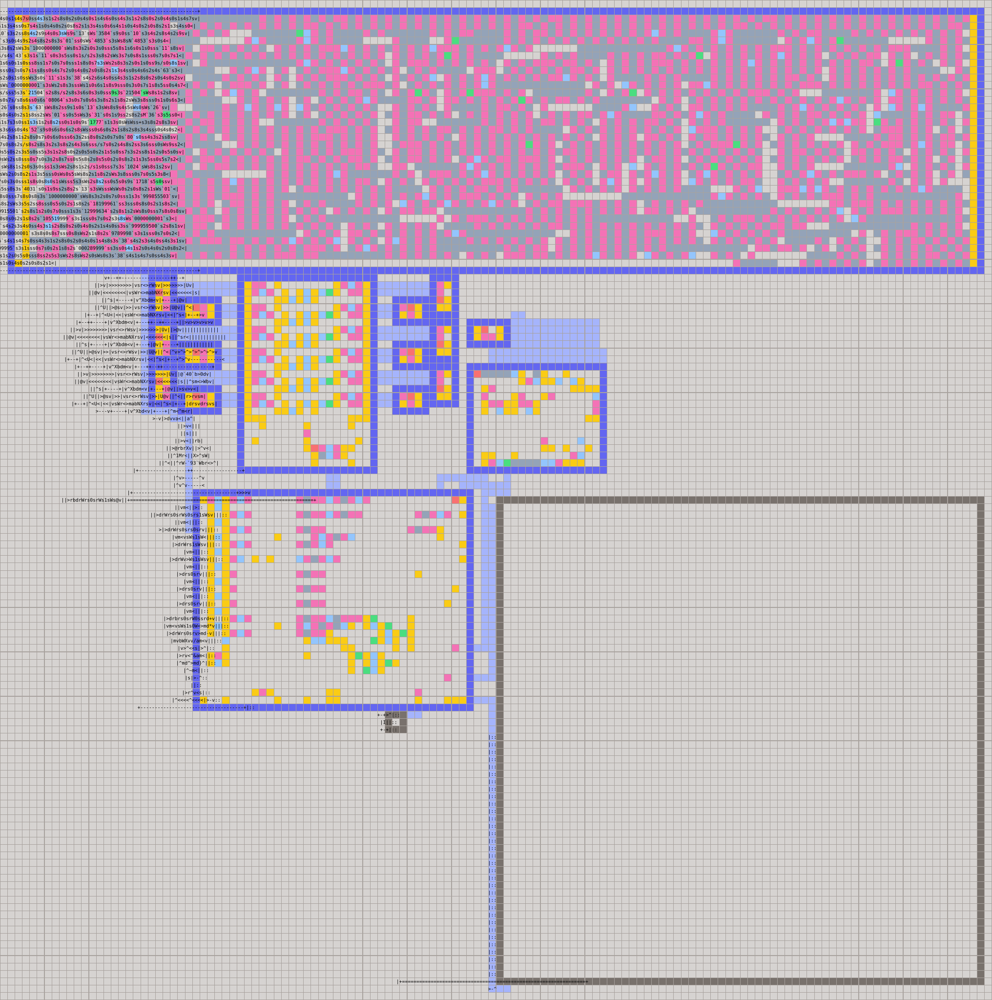](hypercube.man)

## Metaballs

Three independently oscillating metaballs are not drawn so much as inferred from the gravitational spell of their fields. Finite differences carry squared distances across each scanline, six oscillator pairs dream entirely in registers, and fixed-point contributions accumulate until thresholds condense the scalar fog into layered core, middle, and edge colors. 🤯

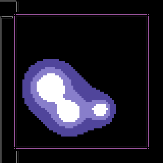

**Area:** 114x113 | **First frame ticks:** 56,134,116 | [Assembly](metaballs.asm) | [Generated `.man`](metaballs.man)

[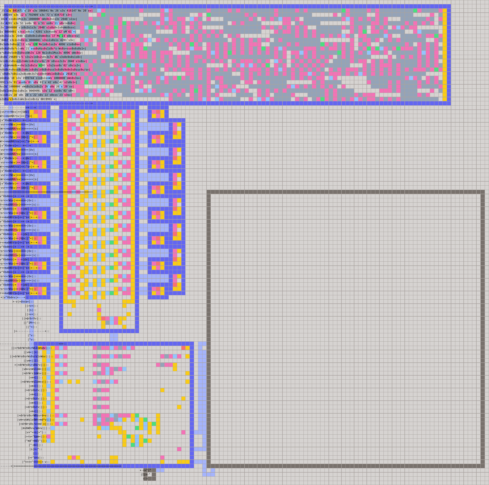](metaballs.man)

## Plasma

A four-wave plasma lets horizontal, vertical, diagonal, and radial waves argue over each pixel until color emerges as their settlement. The vertical wave speaks once per scanline, the other two advance by recurrence, and a rough radius feeds the fourth. Signed parabolas impersonate sine, and four approximate truths add up to one truth that is absolute. 🤯

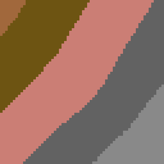

**Area:** 114x106 | **First frame ticks:** 77,323,351 | [Assembly](plasma.asm) | [Generated `.man`](plasma.man)

[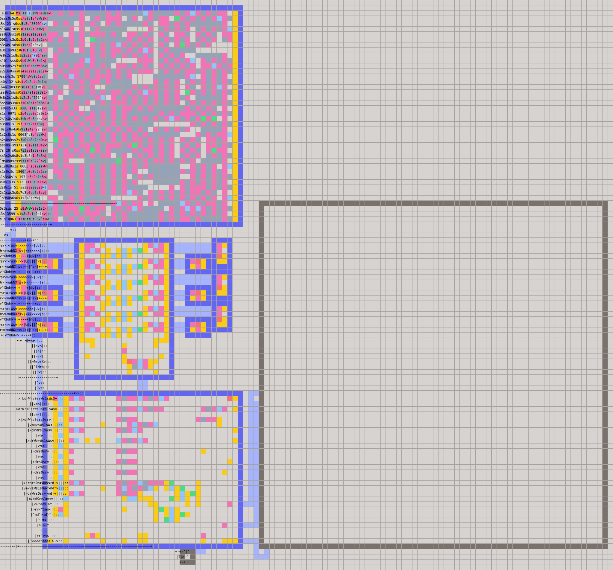](plasma.man)

## Spiral

A rotating, breathing polar grid grows around a center that refuses to stay still. Diamond-angle `atan2` whispers an approximate direction to each Cartesian pixel, a cheap radius guesses its distance, and balanced threshold trees classify exponentially widening bands without per-pixel search loops, leaving several controlled inaccuracies to conspire into one precise spiral. 🤯

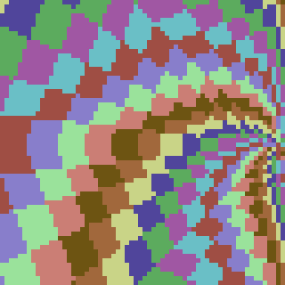

**Area:** 114x100 | **First frame ticks:** 85,519,593 | [Assembly](spiral.asm) | [Generated `.man`](spiral.man)

[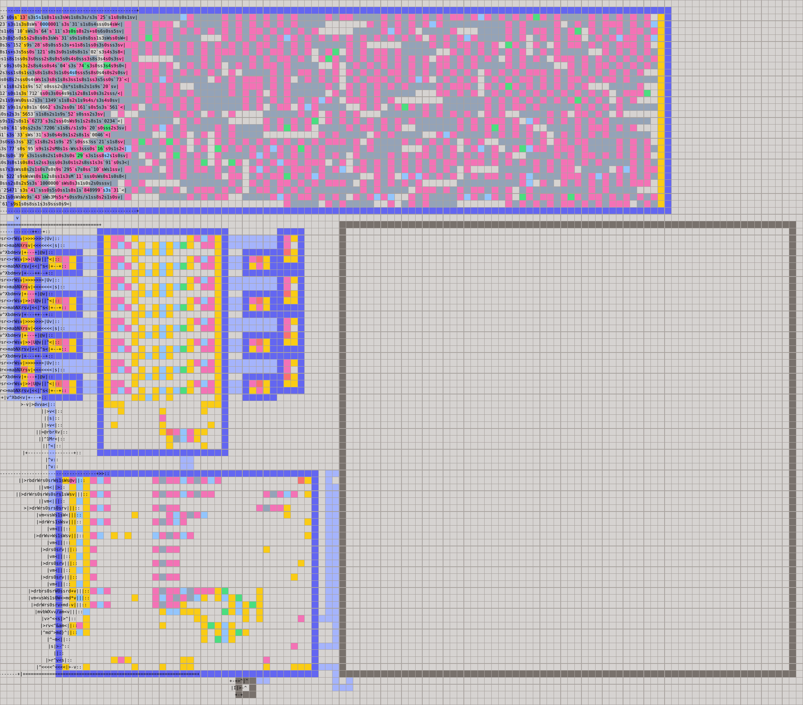](spiral.man)

## Twister

A four-sided scanline twister bends vertically while fixed-point sine approximations rotate the shadow of a square that is never painted. Each row sees only the two visible faces of its projected silhouette and divides them into four colored bands, allowing a stack of unrelated horizontal spans to depict a singular twisting bar of pure solid. 🤯

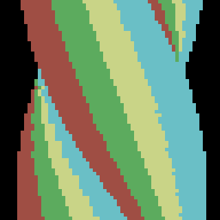

**Area:** 114x97 | **First frame ticks:** 51,316,930 | [Assembly](twister.asm) | [Generated `.man`](twister.man)

[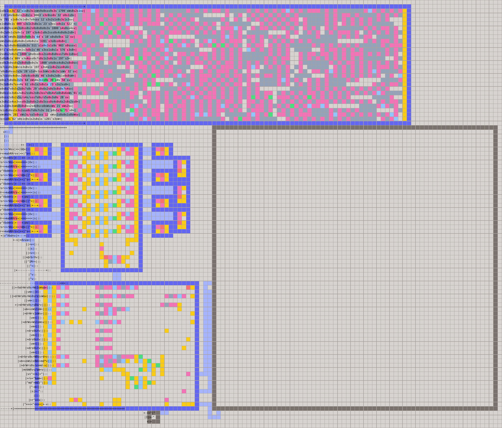](twister.man)

## Mandelbrot

An animated Mandelbrot zoom asks each Q24 pixel to be a complex parameter, then sends its orbit squaring toward either escape or a 64-iteration existential deadline while the view contracts by two percent per frame. Escape time becomes color, but analytic disks tucked inside the main cardioid and period-2 bulb pardon guaranteed interior pixels before iteration begins, allowing geometry to prove that some infinities need never be visited. 🤯

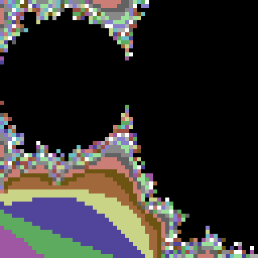

**Area:** 114x88 | **First frame ticks:** 372,068,178 | [Assembly](mandelbrot.asm) | [Generated `.man`](mandelbrot.man)

[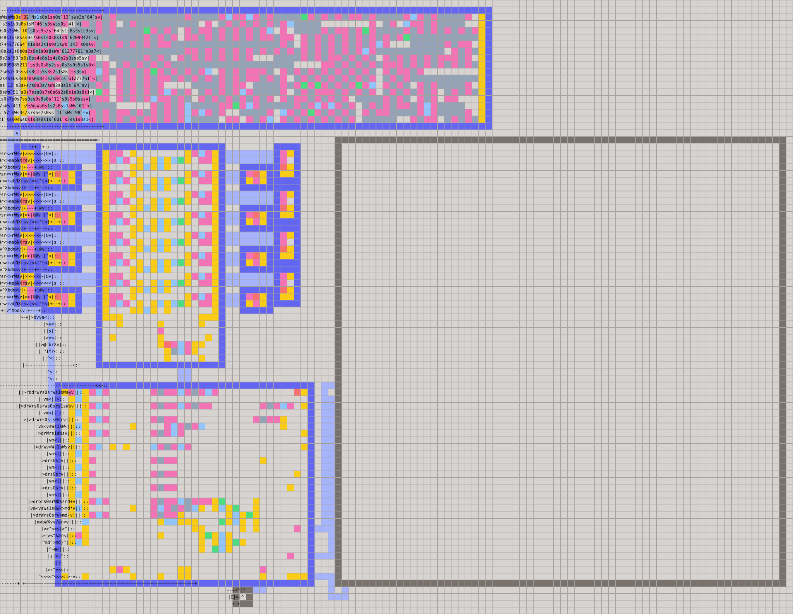](mandelbrot.man)

---

Sleep well! 😇
