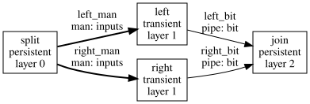
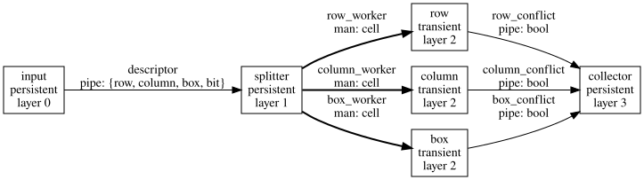
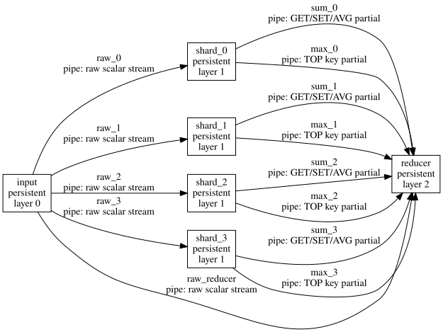
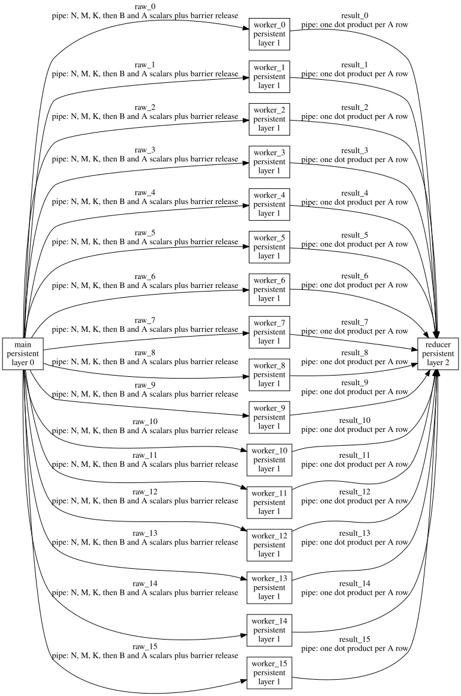
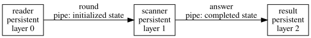

# Flow

Flow is a Python-hosted dataflow language for modelling explicitly parallel Little Man programs.

A program is a validated graph of stages connected by value pipes and by little men created with `Y`.

Features:
- Persistent actors and transient workers.
- Separate transports for pipe values and forked men.
- Forks, gathers, ordered merges, and reductions.
- Fixed-capacity banks with atomic logical updates.
- Validation of stage lifetimes, edge directions, and channel use.

100% vibe-coded by a crazy graph theorist.


## Example

This graph reads two values, sends a copy of the current man down each branch, and combines the independently computed bits:

```python
from flow import (
    Compute, Edge, FlowProgram, Fork, Gather, Halt, ReadInput,
    Reduction, Send, Stage, StageMode, Transport, WriteOutput,
)

program = FlowProgram(
    name="ParallelOr",
    banks=(),
    stages=(
        Stage("split", 0, StageMode.PERSISTENT, (
            ReadInput(("left", "right")),
            Fork(("left_man", "right_man"), preserve_lineage=False),
        )),
        Stage("left", 1, StageMode.TRANSIENT, (
            Compute("bit", "left"),
            Send("left_bit", "bit"),
            Halt(),
        )),
        Stage("right", 1, StageMode.TRANSIENT, (
            Compute("bit", "right"),
            Send("right_bit", "bit"),
            Halt(),
        )),
        Stage("join", 2, StageMode.PERSISTENT, (
            Gather(("left_bit", "right_bit"), "answer", Reduction.BIT_OR),
            WriteOutput("answer"),
        )),
    ),
    edges=(
        Edge("left_man", "split", "left", Transport.MAN, "inputs"),
        Edge("right_man", "split", "right", Transport.MAN, "inputs"),
        Edge("left_bit", "left", "join", Transport.PIPE, "bit"),
        Edge("right_bit", "right", "join", Transport.PIPE, "bit"),
    ),
)

program.validate()
```

Bold edges carry men; solid edges carry pipe values:




## Model

A `FlowProgram` contains banks, stages, and directed edges.

A stage has a layer and one of two lifetimes:
- `PERSISTENT` stages retain a resident lineage across input records.
- `TRANSIENT` stages receive a forked man, perform one job, and must halt.

Edges also have two distinct meanings:
- `PIPE` moves values between actors through a blocking FIFO.
- `MAN` moves computation by creating a man with `Y`; its registers carry the stage state.

Supported logical operations include input, receive, compute, fork, atomic bank update, send, gather, ordered merge, output, and halt. Gathers support bitwise OR, sum, minimum, and maximum reductions.

All edges move to a later graph layer. Validation checks unique names, positive bank capacities, transport-compatible operations, channel direction, and the lifetime rules for persistent and transient stages.


## Architecture

Physical `.man` file emitters currently exist only for particular task profiles.

The current pipeline is:

```text
Python task builder -> validated Flow graph -> profile emitter -> .man
```

The graph captures ownership, communication, and parallel scheduling.

A profile emitter then chooses concrete rooms, banks, ports, loops, and routes.


## Case Study: Sudoku Auditor

Sudoku exposes Flow's central idea particularly clearly:



The input stage encodes one placement. The splitter creates row, column, and box workers with `Y`. Each worker checks and updates its own nine-slot mask bank, then sends a conflict flag through a pipe. The collector gathers all three flags and emits their combined result.


## Case Study: Grade Book

Grade Book partitions records across four persistent shards. The input stream is broadcast to every shard and to a reducer; roster row `i` belongs to shard `i mod 4`.



Each operation scans all four shards concurrently. GET, SET, and AVG produce partials reduced by sum. TOP produces a combined grade-and-ID key reduced by maximum. A strict zipper keeps one result from each shard together, preventing a fast shard from leaking the next operation into the current reduction.

This is the practical benefit of the dataflow representation: storage, computation, and reduction are separate actors whose parallel schedule is explicit in the graph.


## Case Study: Matrix Multiplication

The default matrix backend uses sixteen column workers. The main actor keeps matrix `A` in a 256-cell FIFO and broadcasts metadata, matrix `B`, and replayed rows of `A`. Worker `j` stores only column `j` of `B` in a local ring and emits one dot product per row of `A`.



Only the first `K` workers are active. The remaining workers drain the shared stream so they cannot block the broadcast. Results are merged in column order, and a sixteen-worker barrier prevents one matrix round from overtaking the next. The default generated implementation is `336x348` and completes the full `16x16` stress case in about 115,000 ticks.


## Case Study: Brackets

Brackets is a deliberately sequential profile. It packs a stack of opening brackets into one signed 64-bit value using two bits per entry. A separate depth counter is necessary because a full 32-entry packed stack may be negative.



This profile shows that Flow graphs can also describe persistent state machines; parallelism is explicit rather than mandatory.


## Folding Experiment

The independent [flow/folding](flow/folding/README.md) experiment extracts a room into a direction-aware control-flow graph. Blocking and branching cells become nodes, while arithmetic instructions become ordered actions on edges. The state includes both the cell and arrival direction, so two paths crossing through the same blank cell do not become a false join. Profiled traversal counts weight hot edges. Simulated annealing places nodes, then an A* router synthesizes paths and arrows while preserving port-selection and instruction-order constraints.
