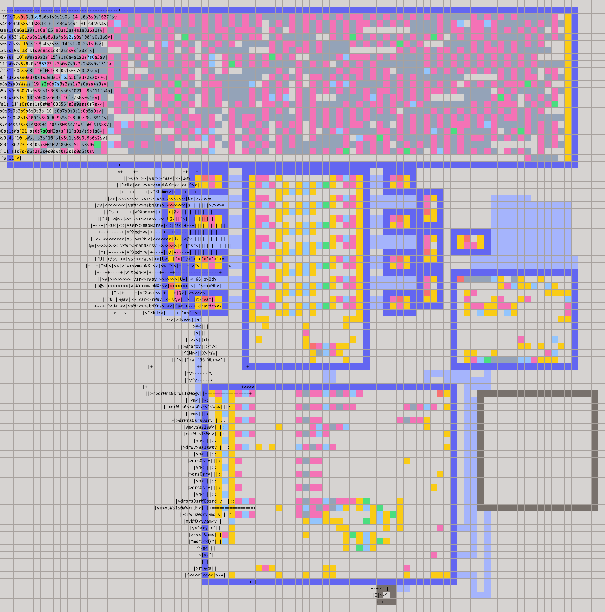
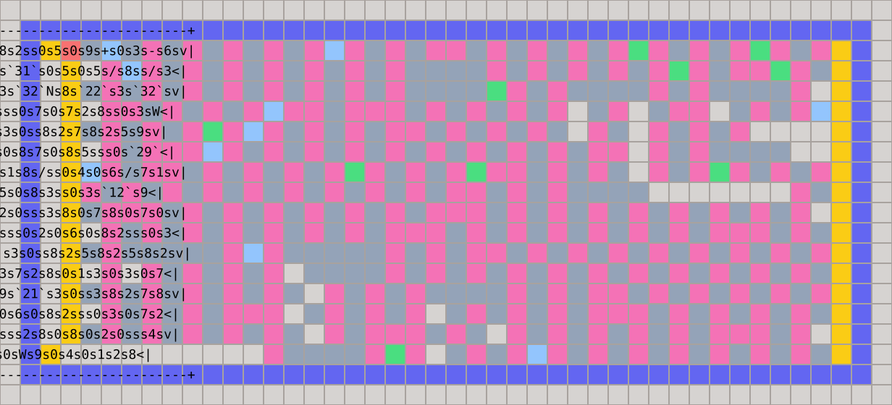
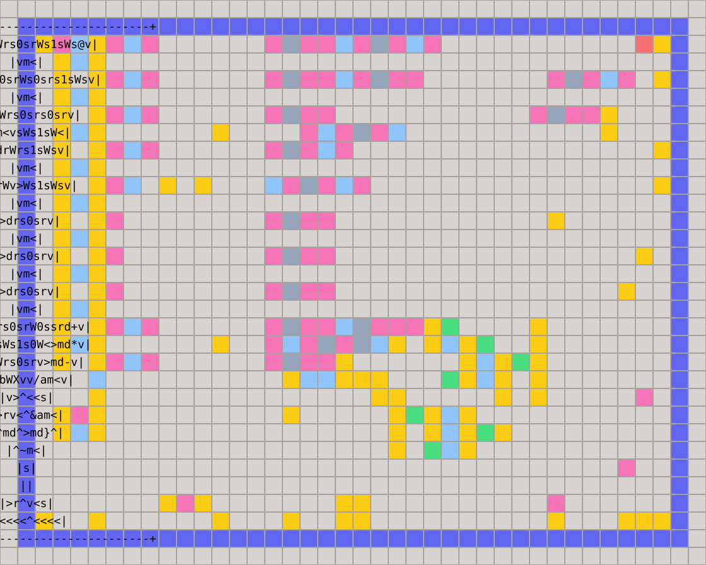
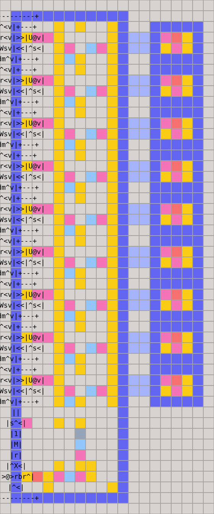
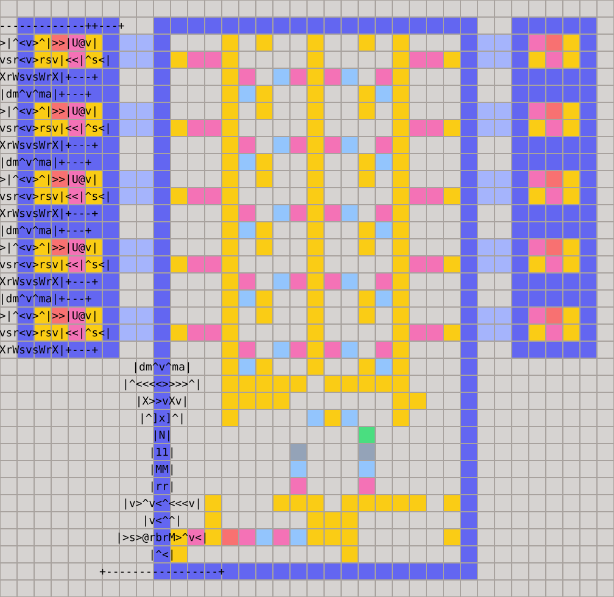
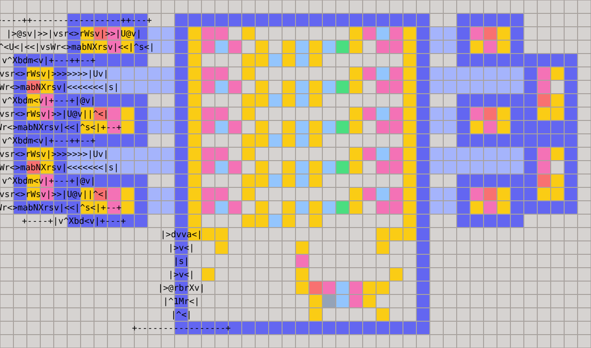
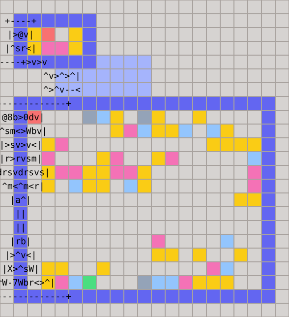

# Processor

This is a small general-purpose CPU implemented in Little Man and an assembler implemented in Rust that turns assembly programs into complete `.man` solutions. The generated floor includes the program source, the required register bank, the CPU, optional memory, and an optional display.

The assembler expands pseudo-instructions, computes register liveness over the cyclic control-flow graph, and aliases registers whose live ranges do not interfere. It omits memory when the program has no `load` or `store` instructions and omits the display unless the source declares `.screen`.


## Architecture

A generated machine consists of independent physical components joined by blocking FIFO pipes. The code room streams instruction words into the CPU. The CPU reads and writes a generated register bank, optionally talks to RAM, and connects either to ordinary I/O rooms or to a display.



This example is the Snake program with a staggered two-lane register bank. Its source ring spans the top. Beneath it sit the register bank and 66-slot RAM, followed by the CPU and a `16x16` display. RAM's 132-cell storage pipe folds upward into the free space beside its controller.


### Program Ring



Instructions are encoded as signed decimal words and packed into a horizontal or vertical zigzag. A resident little man walks the room forever, sending the words to the CPU in order. The room therefore acts as a cyclic ROM without needing an address decoder.

Branches work on the stream rather than changing a program counter: the CPU discards a computed number of words until the target instruction arrives. Unconditional jumps include their forward skip in one command word. Backward jumps wrap around the ring.

The floorplanner optimizes both room orientations and many dimensions, checks numeric-literal quoting globally, and connects the chosen room to the CPU with a buffered pipe.


### CPU Core



The CPU is a stream decoder driven by one resident little man. It reads an opcode followed by that instruction's operands, then follows a dedicated path for register transfer, memory, arithmetic, branching, I/O, or display operations. Every peripheral request is blocking, so instruction execution naturally waits until the selected component has completed its transaction.

The ALU accumulates through `r0`; the `*0` instructions expose this short physical path directly. Three-address and immediate instructions are assembler expansions around the same core operations. The diagram shows the screen-capable CPU, which adds paths for display address, data, and swap operations. Programs without a display use the slightly shorter ordinary core.


## Register Banks

Registers are tiny self-refreshing repeater rooms initialized to zero. A cell always sends its current value and waits for a replacement. On a read, the controller returns that value to both the CPU and the cell; on a write, it discards the old value and sends the new one back. The selector returns to its controller before accepting another request.

The following diagrams contain the same nine logical registers after liveness allocation. Two-lane layouts require an even cell count, so their tenth physical cell is unused.


### Single Lane



The default is one narrow vertical selector with a register cell at every station. It has the least surrounding machinery and works well for small programs, but access time grows with the distance to the selected register.


### Two Lane



The two-lane bank splits even and odd registers between cells on opposite sides of the selector. Each lane is only half as deep, reducing average access time in exchange for a wider layout.


### Staggered Two Lane



The staggered design tests a pair of registers at each selector level. Alternating cells rotate into the gaps between their neighbors, fitting two logical rows into less height. Its unified selector and denser cells make it both smaller and faster than the classic two-lane layout for our larger programs.

This is the preferred physical layout for optimized builds and can be combined with PGO (see below).


## RAM



RAM stores its values as tokens in a folded FIFO ring. For each indexed operation, the memory controller rotates the resident values, reads or replaces the selected one, and restores their logical order. The storage path is generated as a compact accordion with exactly the requested capacity.

The diagram shows eight logical slots in a 16-cell storage pipe. The default pipe size is `2 * SIZE` because an update can transiently hold both resident and replacement values. RAM and all of its connecting pipes disappear when the assembled program contains no `load` or `store` instruction.


## Display and I/O

Ordinary programs communicate through Little Man input and output rooms. A `.screen WIDTH HEIGHT` declaration instead adds a double-buffered display and selects the screen CPU. Assembly instructions choose a pixel address, write a palette index to the back buffer, and swap the completed frame onto the screen.

Display dimensions are generated from the declaration. The assembler also adjusts its lower connection and raises a memoryless display when that reduces the final bounding box.


## Assembly

Assembly language is case-insensitive. Commas are optional. Both `;` and `#` start a comment. Registers may be written as `r0`, `r1`, and so on. A label is an identifier followed by `:`.

```asm
start:
  read r2
  imm r3, 1
  add r4, r2, r3
  write r4
  jmp start
```

Jumps use labels. The assembler converts each label into a forward word skip through the cyclic program stream, including wraparound for backward jumps.


### Directives

```asm
.memory 64
.memory 64 160
.screen 16 16
.kind snake
.reg frame r2
.reg oscillator[8] r16
```

- `.memory SIZE [PIPE_CELLS]` configures RAM. The storage pipe defaults to `2 * SIZE`; an explicit size must be even and at least `2 * SIZE`. The memory module is generated only when the program accesses memory. A program that accesses memory without this directive receives 8 slots and a 16-cell storage pipe.
- `.screen WIDTH HEIGHT` adds a display of a specified size (from 1 through 64).
- `.kind NAME` selects reference tests for `plotter`, `snake`, `pathfinder`, `lllm`, `llm`, or `matmul`.
- `.reg NAME REGISTER` gives a register a source-level name. Writing `NAME[COUNT]` declares a contiguous array beginning at `REGISTER`, addressed with constant indices such as `oscillator[3]`. Several names may alias the same register, which is useful when setup and runtime give a slot different roles. Aliases allocate no registers and are resolved before liveness-based register merging.

Repeated source can be generated with an inclusive range. `{i}` is replaced with the current index:

```asm
.repeat 2 5
  imm r{i} 0
.endrepeat
```


## Instructions

### Data Movement

```asm
mov   DST SRC
imm   DST VALUE
read  DST
write SRC
load  DST ADDRESS
store ADDRESS SRC
```

`load` and `store` are register-indirect:

```text
DST = memory[register[ADDRESS]]
memory[register[ADDRESS]] = register[SRC]
```

`write` is unavailable in screen programs because that opcode is used by the display protocol.


### Arithmetic

Three-address register operations:

```asm
add DST LHS RHS
sub DST LHS RHS
mul DST LHS RHS
div DST LHS RHS
and DST LHS RHS
shr DST LHS RHS
```

Immediate forms:

```asm
addi DST LHS VALUE
subi DST LHS VALUE
muli DST LHS VALUE
divi DST LHS VALUE
```

The physical ALU accumulates into `r0`. Accumulator instructions expose that fast path directly:

```asm
add0 r7
sub0 r7
mul0 r7
div0 r7
and0 r7
shr0 r7
xor0 r7

addi0 16
subi0 16
muli0 16
divi0 16
andi0 16
shri0 16
xori0 16
```

For example, `add0 r7` computes `r0 = r0 + r7`, while `addi0 16` computes `r0 = r0 + 16`.

Additional pseudo-instructions:

```asm
inc REG
dec REG
neg REG
alu OP
```

`alu OP` applies the named operation to `r0` and `r1`. Valid names are `add`, `mul`, `sub`, `div`, `and`, `shr`, and `xor`; their Little Man symbols are accepted as aliases.

Division follows Little Man semantics: the quotient is floored and the remainder is left in the secondary ALU register. Division by zero produces a zero quotient and preserves the dividend as the remainder.


### Control Flow

```asm
jc   COND LABEL
jpos COND LABEL
jmp  LABEL

jeq   REG VALUE LABEL
jeqs  REG VALUE LABEL
jeqr  LHS RHS LABEL
jeqrs LHS RHS LABEL
```

`jc` and `jpos` jump only when `register[COND] > 0`. The equality operations are assembler pseudo-instructions; the `s` variants use a shorter comparison sequence when its constraints are suitable.


### Display

A source containing `.screen` uses:

```asm
screen_addr REG
screen_data REG
screen_swap REG
```

`screen_commit` is an alias for `screen_swap`.

- `screen_addr` selects the pixel address.
- `screen_data` writes a palette index to the back buffer.
- `screen_swap` presents the frame. Its register value controls whether the previous frame is preserved according to the display protocol.


### Packed Loads

The assembler includes specialized packed-memory helpers:

```asm
load4 DST POSITION ADDRESS INDEX FACTOR QUOTIENT
load8 DST POSITION ADDRESS INDEX FACTOR QUOTIENT
```

They extract a 4-bit or 8-bit value from packed memory while using the named registers as working storage.

`matmul` emits the specialized Matrix Multiplication routine used by the corresponding task source.


## Machine Model

The program source continuously streams instruction words through a ring. The CPU consumes one opcode followed by that instruction's operands. Branches discard a computed number of words from the same cyclic stream.

The register and memory peripherals share a request protocol:

```text
INDEX 0
    Read slot INDEX and return its value.

INDEX 1 VALUE
    Replace slot INDEX with VALUE.
```

Register operands are literal indices. Memory addresses are obtained by reading the specified address register first.


### Word Encoding

Without a display:

|      Opcode | Instruction         | Words           |
|------------:|---------------------|-----------------|
|           0 | `mov DST SRC`       | `0 DST SRC`     |
|           1 | `store ADDRESS SRC` | `1 ADDRESS SRC` |
|           2 | `load DST ADDRESS`  | `2 DST ADDRESS` |
|           3 | `imm DST VALUE`     | `3 VALUE DST`   |
|           4 | `read DST`          | `4 DST`         |
|           5 | `write SRC`         | `5 SRC`         |
|           6 | ALU                 | `6 OP SRC`      |
|           7 | positive jump       | `7 OFFSET COND` |
| 8 and above | unconditional jump  | `8 + OFFSET`    |

With a display, opcodes 0 through 4 are unchanged. Opcodes 5, 6, and 7 become `screen_swap`, `screen_addr`, and `screen_data`; ALU and positive jump move to opcodes 8 and 9. Values 10 and above encode an unconditional jump as `10 + OFFSET`.

ALU operation numbers are:

| Operation   | Code |
|-------------|-----:|
| add         |    0 |
| multiply    |    1 |
| subtract    |    2 |
| divide      |    3 |
| bitwise AND |    4 |
| shift right |    5 |
| bitwise XOR |    6 |

Offsets are forward word counts measured after the jump instruction has consumed its own words. Unconditional jumps fold that offset into their command word, so they occupy one word. Assembly authors normally use labels and do not need to calculate them.


## Floorplanning

The floor is assembled from:

- [`meta_template.mod`](meta_template.mod), the universal component layout;
- [`cpu.mod`](cpu.mod), the ordinary CPU;
- [`cpu_screen.mod`](cpu_screen.mod), the display-capable CPU;
- [`memory.mod`](memory.mod), the optional memory bank.

Register cells are repeaters initialized to zero. The assembler places only as many cells as static liveness allocation requires. RAM uses a generated accordion storage pipe sized by `.memory`. The program source is packed into the smallest feasible horizontal or vertical room and connected to the CPU by a buffered cyclic pipe.


## Register Allocation

Static liveness analysis is always enabled. It analyzes the cyclic control-flow graph, builds an interference graph, and aliases logical registers whose live ranges do not overlap. Move-related registers are preferentially assigned the same slot. This pass runs before PGO and determines how many physical register cells are generated.

There is no option to disable this pass.


## Profile-Guided Optimization (PGO)

`--pgo` runs the assembled program in the internal VM, counts register reads and writes, and renumbers registers so the hottest ones occupy the cheapest physical positions. `r0` remains in its dedicated fast slot. PGO runs after liveness allocation and verifies that register renumbering does not change the produced frames.


## Verification

`--test` runs the assembled instruction stream in the internal VM. The `.kind` directive selects the Plotter, Snake, Pathfinder, LLLM, LLM, or Matrix Multiplication reference tests. Generic display programs receive a one-frame smoke test.

Reference inputs are embedded into the assembler at build time from [`../public_tests`](../public_tests).
