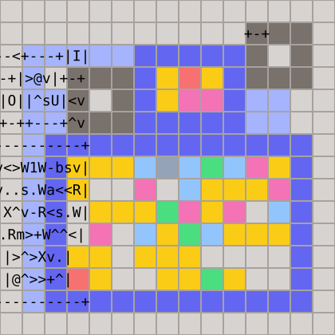
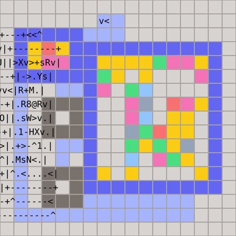
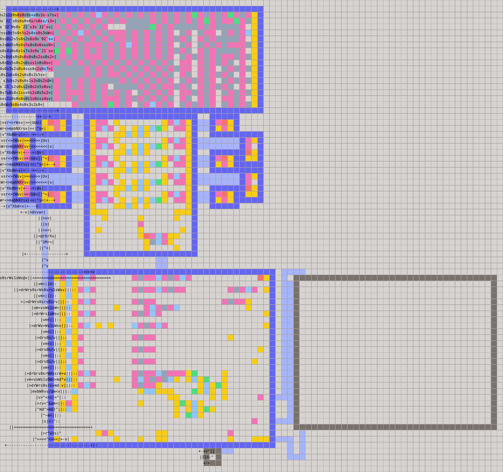
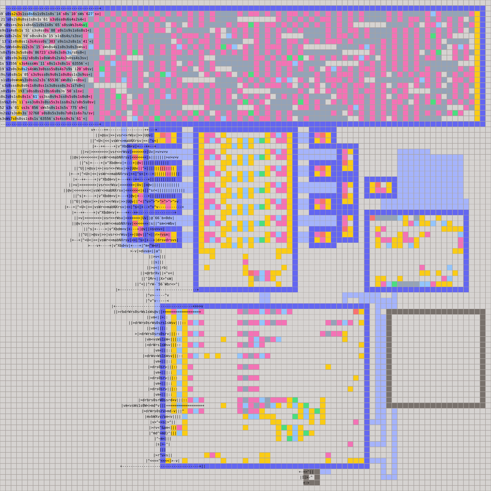
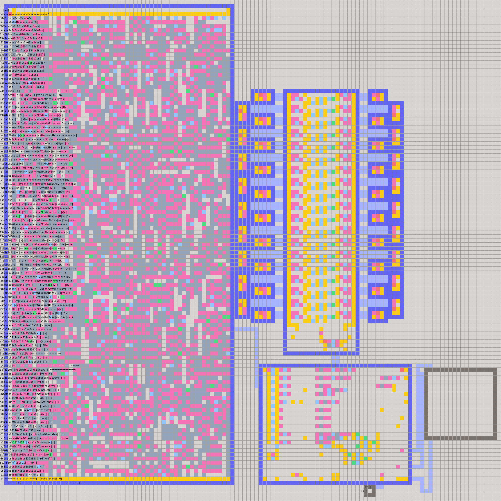
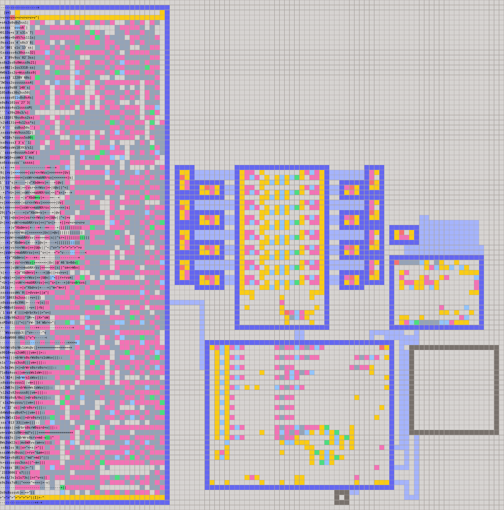
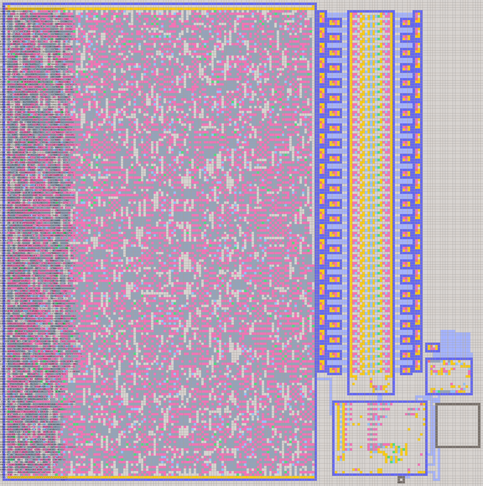

# Current Best Solutions

These are post-contest improvements of our solutions.

The [Processor](../../processor)-based solutions use profile-guided register numbering, the staggered two-lane register bank, packed one-word jumps, tighter CPU modules, and improved code-room placement.

## Sort

This hand-crafted selection sorter uses one loopback FIFO as both its working set and its pass scheduler. On each pass, the main man keeps the smallest value in `B`, returns every other value to the loop, and counts the scan in his backpack. The shrinking pass length travels through the same FIFO; when a scan ends, the minimum is emitted and the next pass begins.

| Version   |  Area | Footprint | Average public ticks | Score improvement |
|-----------|------:|----------:|---------------------:|------------------:|
| Submitted | 22x22 |       484 |              2,310.3 |                 - |
| Current   | 13x13 |       169 |              1,709.6 |             74.2% |

[Current `.man`](sort13.man) | [Submitted `.man`](../submitted/sort-numbers-f3d2a564.man)

## Packet Reassembly

This version replaces the addressed window and presence mask with a circulating packet queue. The main man keeps the next expected sequence number in `B`; ready packets are emitted immediately, while each future `(sequence, value)` pair is returned to the loop and tested again on its next lap. A short-lived fork subtracts 16 in parallel and emits `-1` when a packet lies outside the permitted window.

| Version   |  Area | Footprint | Average public ticks | Score improvement |
|-----------|------:|----------:|---------------------:|------------------:|
| Submitted | 54x53 |     2,916 |             29,527.0 |                 - |
| Current   | 15x15 |       225 |              2,261.8 |             99.4% |

[Current `.man`](tcp15.man) | [Submitted `.man`](../submitted/tcp-273ea9b5.man)

## Plotter

| Version   |   Area | Footprint | Average public ticks | Score improvement |
|-----------|-------:|----------:|---------------------:|------------------:|
| Submitted | 131x83 |    17,161 |            302,262.3 |                 - |
| Current   |  82x82 |     6,724 |            301,869.7 |             60.9% |

[`.asm` source](../../processor/solutions/plotter.asm) | [Current `.man`](plotter.man) | [Submitted `.man`](../submitted/plotter-ca209a0b.man)

## Snake

| Version   |   Area | Footprint | Average public ticks | Score improvement |
|-----------|-------:|----------:|---------------------:|------------------:|
| Submitted | 115x99 |    13,225 |            566,133.4 |                 - |
| Current   |  87x87 |     7,569 |            537,697.4 |             45.6% |

[`.asm` source](../../processor/solutions/snake.asm) | [Current `.man`](snake.man) | [Submitted `.man`](../submitted/snake-3235b21c.man)

## Pathfinder

| Version   |    Area | Footprint | Average public ticks | Score improvement |
|-----------|--------:|----------:|---------------------:|------------------:|
| Submitted | 127x128 |    16,384 |          4,632,074.7 |                 - |
| Current   | 122x122 |    14,884 |          4,330,698.7 |             15.1% |

[`.asm` source](../../processor/solutions/pathfinder.asm) | [Current `.man`](pathfinder.man) | [Submitted `.man`](../submitted/pathfinder-eeea38fc.man)

## Little Little Little Man

| Version   |   Area | Footprint | Average public ticks | Score improvement |
|-----------|-------:|----------:|---------------------:|------------------:|
| Submitted | 116x82 |    13,456 |          2,265,456.9 |                 - |
| Current   | 99x100 |    10,000 |          2,120,529.4 |             30.4% |

[`.asm` source](../../processor/solutions/lllm.asm) | [Current `.man`](lllm.man) | [Submitted `.man`](../submitted/little-little-little-man-c93bee5f.man)

## Little Little Man

| Version   |    Area | Footprint | Average public ticks | Score improvement |
|-----------|--------:|----------:|---------------------:|------------------:|
| Submitted | 170x249 |    62,001 |         20,465,869.7 |                 - |
| Current   | 190x191 |    36,481 |         17,668,125.5 |             49.2% |

The maximum side falls from 249 to 191 while average ticks drop by 13.7%.

[`.asm` source](../../processor/solutions/llm.asm) | [Current `.man`](llm.man) | [Submitted `.man`](../submitted/little-little-man-312c98a9.man)

