# Submitted Solutions 🏆

These are the exact `.man` files submitted during the contest.

Improved post-contest solutions are collected in [`current_best`](../current_best/README.md).

Tick counts are arithmetic means over [`public_tests`](../../public_tests).


## Triangle

The entire solution is one arithmetic room implementing `n*(n+1)/2`.

Found by a combination of algorithmic search and manual exploration.

**Area:** 8x8 | **Average public ticks:** 13.0

[`.man` file](triangle-197591cf.man)

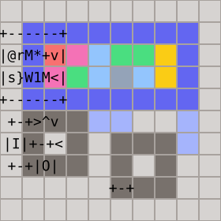


## Memory

A cyclic memory keeps all 100 values in a pipe. The address becomes a timed rotation count, bringing the selected value to a compact engine that either repeats it unchanged or substitutes a write value.

The final version is a hand-tuned output of [Meme](../../meme):
```text
program Memory

memory cells[100] = 0

forever:
    op = input()
    address = input()
    if op == 0:
        output(cells[address])
    else:
        cells[address] = input()
```

**Area:** 20x20 | **Average public ticks:** 22,114.7

[`.man` file](memory-0f4ea0ee.man)

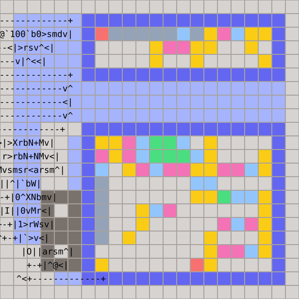


## Reverse a List

Each input value is retained by a newly forked man. The number of times a man goes through the loop before outputting his value starts from N and decreases for each subsequent man, so the values are sent to the output in reverse order.

The final version is hand-crafted.

**Area:** 10x11 | **Average public ticks:** 338.6

[`.man` file](reverse-a-list-6335f8d6.man)

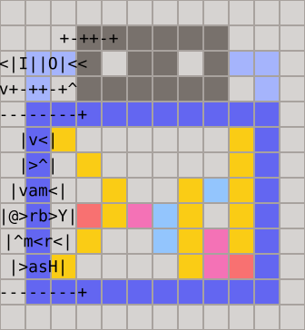


## Sort

Was initially implemented with [Meme](../../meme):
```text
program Sort

dynamic memory values[16]

forever:
    n = input()
    repeat n:
        values.push(input())
    repeat n:
        minimum = values.extract_min()
        output(minimum)
```

The final version is a more compact (but still sloppy) rewrite.

**Area:** 22x22 | **Average public ticks:** 2,310.3

[`.man` file](sort-numbers-f3d2a564.man)

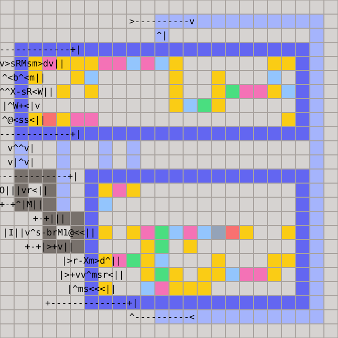


## History Lesson

The static encoder uses structured Base-99 tokens, three fixed phrases, and 24 corpus-trained digrams.

The `.man` file implements a radix unpacker, pair table, and an arithmetic ASCII mapper.

See [compressor](../../compressor) for further details and design exploration.

**Area:** 81x82 | **Average public ticks:** 210,508.0

[`.man` file](history-lesson-b158eeed.man)


## Brackets

The final solution is hand-crafted. It uses a looped pipe to implement a stack -- `push` writes to the pipe, `pop` rotates the pipe for N-1 steps and reads.

**Area:** 37x34 | **Average public ticks:** 2,485.7

[`.man` file](brackets-ab3e01e9.man)

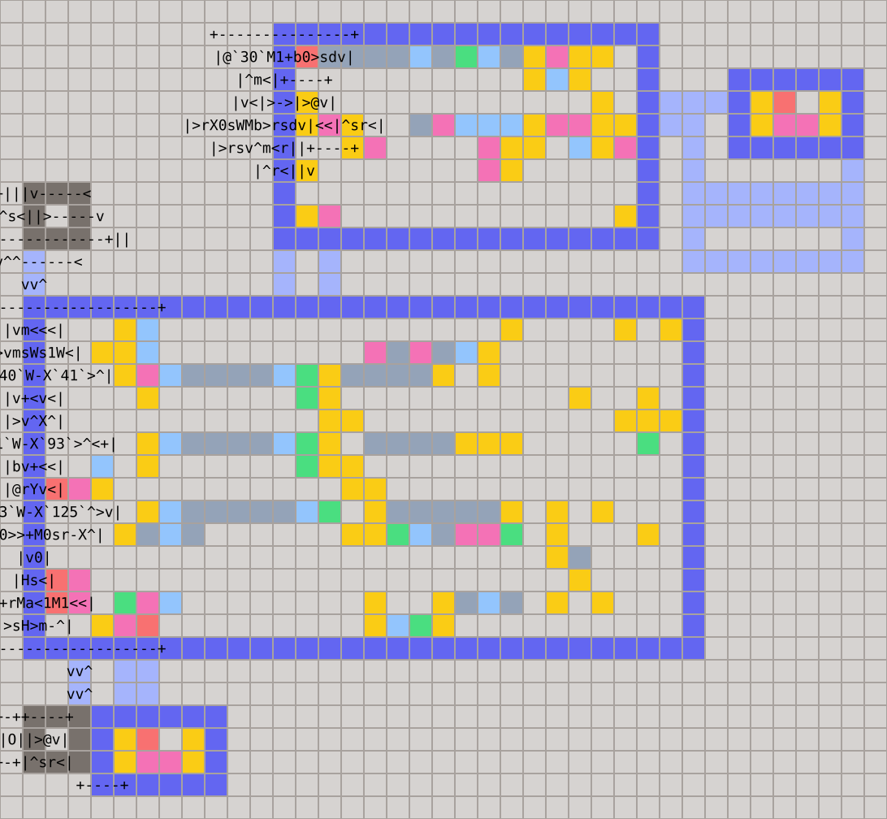


## Packet Reassembly

Solved with [Meme](../../meme).

A sixteen-value ring is combined with a sixteen-bit presence mask. The ring head is always the next expected sequence number, so each arrival is stored by relative offset and contiguous packets drain without modulo arithmetic.

**Area:** 54x53 | **Average public ticks:** 29,527.0

[`.man` file](tcp-273ea9b5.man)

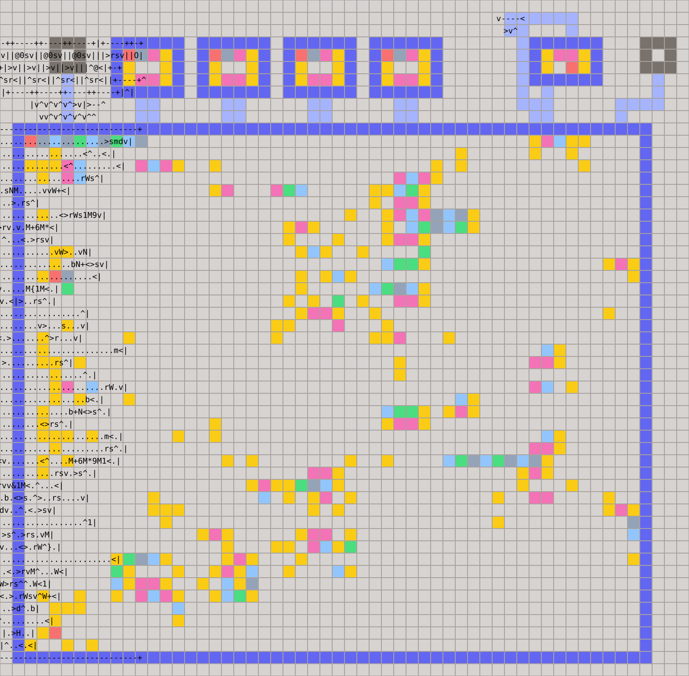


## Plotter

Implemented with the [Processor](../../processor).

A register-only Bresenham rasterizer selects separate shallow and steep loops. It advances a linear display address using signed x/y strides and draws both endpoints of each line.

**Area:** 131x83 | **Average public ticks:** 302,262.3

[`.asm` source](../../processor/solutions/plotter.asm) | [`.man` file](plotter-ca209a0b.man)

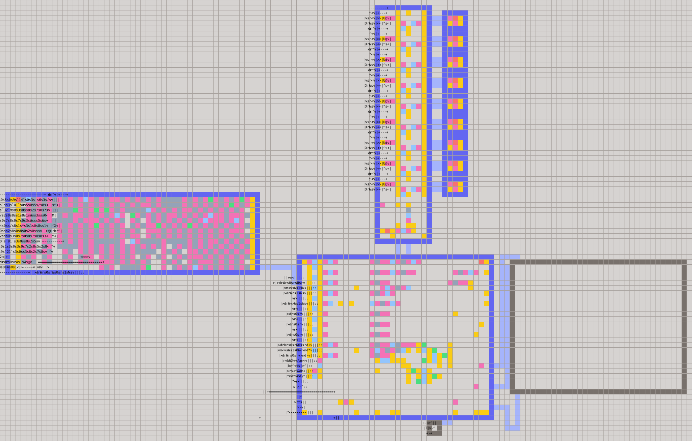


## Grade Book

Solved with [Flow](../../flow).

A four-shard design packs each student ID and four grades into one ring value. All shards scan concurrently; sums answer GET and AVG, while a combined grade-and-inverse-ID key gives TOP its required tie-break.

**Area:** 247x252 | **Average public ticks:** 36,550.4

[`.man` file](gradebook-1a053174.man)

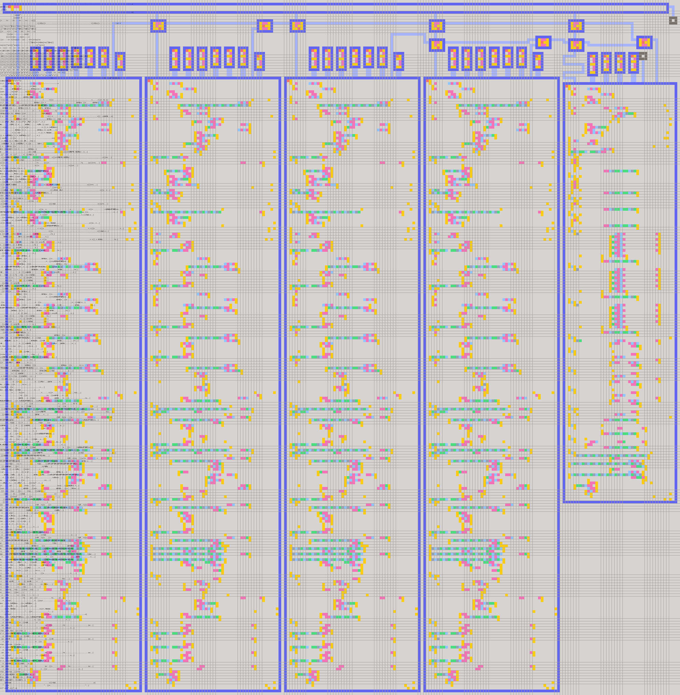


## Matrix Multiplication

Solved with [Flow](../../flow).

A sixteen-lane pipeline stores matrix A in a replay FIFO and gives each worker one column of B. Workers compute columns concurrently; an ordered merge and barrier preserve row-major output across rounds.

**Area:** 149x241 | **Average public ticks:** 19,493.4

[`.man` file](matmul-cae2a2ba.man)

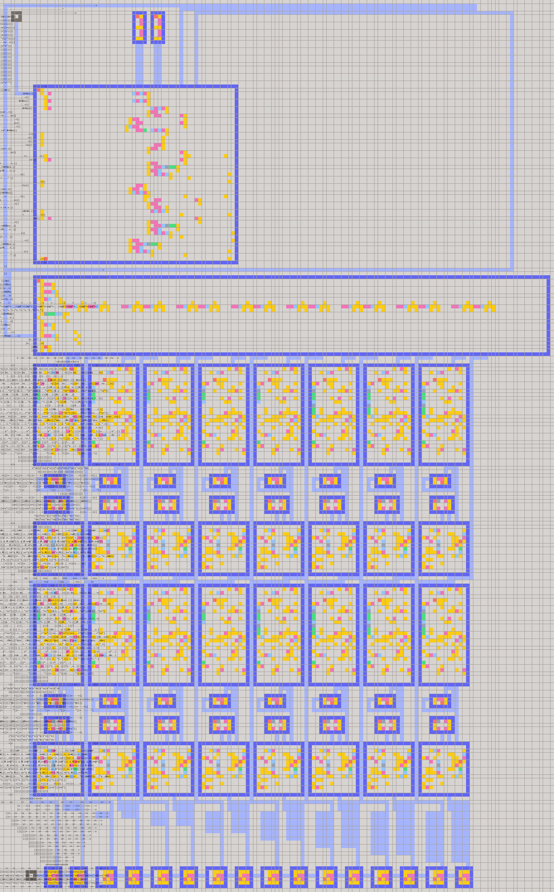


## Sudoku Auditor

Solved with [Flow](../../flow).

A splitter forks row, column, and box workers for every cell. They update independent nine-slot bitmask banks in parallel, and a collector ORs their conflict flags into the verdict.

**Area:** 35x35 | **Average public ticks:** 8,795.7

[`.man` file](sudoku-validity-21542b04.man)

[Sudoku Auditor solution](images/sudoku-validity-21542b04.svg)


## Subset Sum

The final solution is hand-crafted.

The idea is running a 6-tick loop that iterates over all 2^n bitmasks and spawns a pair of little men on each iteration. One man of a pair uses the backpack `x` and `[` operations to calculate the sum, and the other man carries the mask. If the sum doesn't match the target, the two men annihilate, otherwise, the man carrying the mask proceeds to extract the answer.

**Area:** 70x102 | **Average public ticks:** 140,269.4

[`.man` file](subset-sum-2402a831.man)

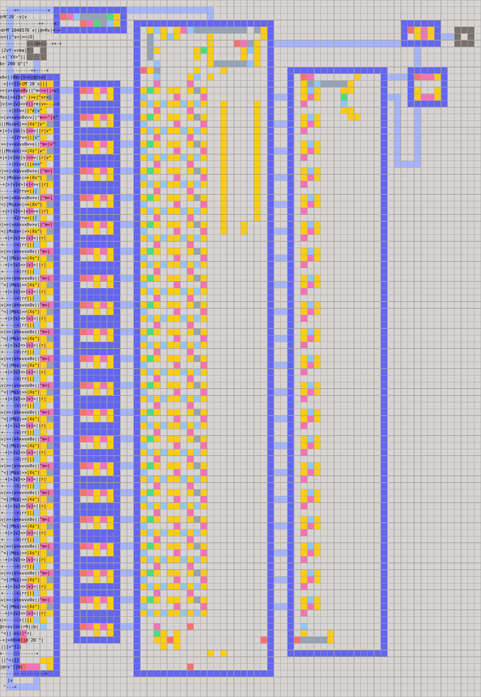


## Snake

Implemented with the [Processor](../../processor).

Board occupancy is stored as sixteen row bitmasks, while a 50-entry circular queue holds the body. Normal moves clear the old tail and draw the new head; fruit is drawn when spawned, and a collision recolors the whole body. No update requires a full-screen pass.

**Area:** 115x99 | **Average public ticks:** 566,133.4

[`.asm` source](../../processor/solutions/snake.asm) | [`.man` file](snake-3235b21c.man)

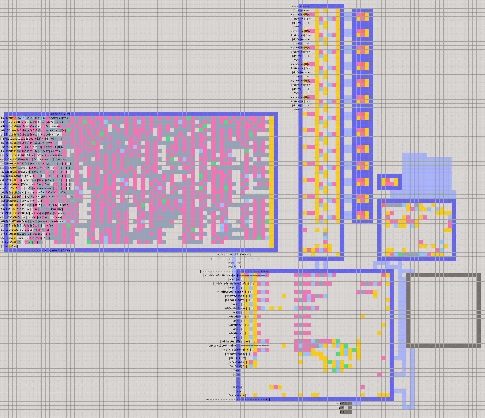


## Pathfinder

Implemented with the [Processor](../../processor).

The program performs a RAM-free reverse BFS from each flag over a 16x16 board. Groups of four registers form 256-bit bitboards for walls, open cells, frontiers, and three preferred directions; left is implicit. The robot then follows those masks to the flag, redrawing only its old and new cells.

**Area:** 127x128 | **Average public ticks:** 4,632,074.7

 [`.asm` source](../../processor/solutions/pathfinder.asm) | [`.man` file](pathfinder-eeea38fc.man)

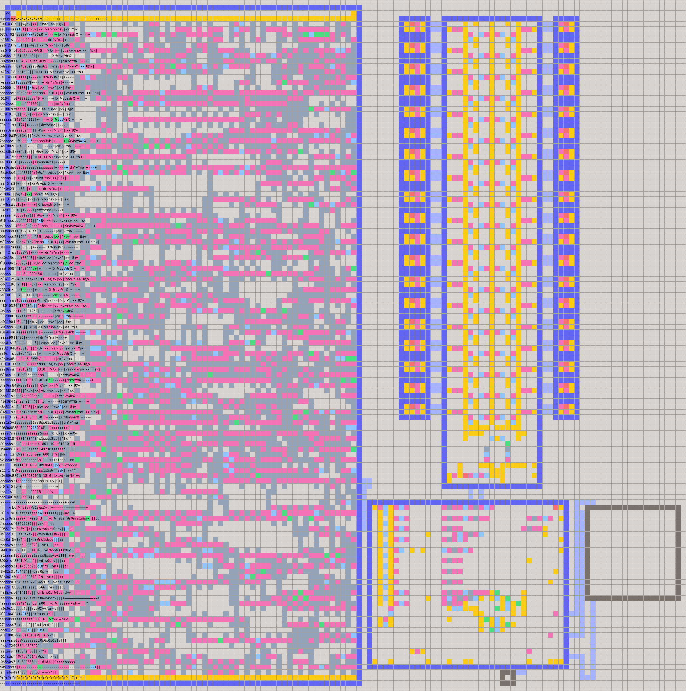


## Little Little Little Man

Implemented with the [Processor](../../processor).

The single-room source is converted to five-bit tokens and packed twelve per RAM word. The interpreter keeps the simulated man's position, direction, A, and B in registers, fetches instructions from packed RAM, and redraws only the previous and current execution cells.

**Area:** 116x82 | **Average public ticks:** 2,265,456.9

 [`.asm` source](../../processor/solutions/lllm.asm) | [`.man` file](little-little-little-man-c93bee5f.man)

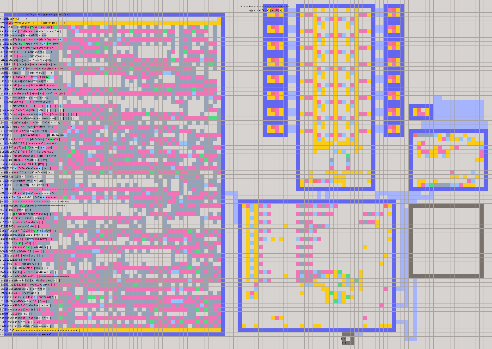


## Little Little Man

Implemented with the [Processor](../../processor).

Eight source bytes are packed into each RAM word. The interpreter discovers up to three room bounds and traces up to two pipes, then keeps man state plus pipe occupancy and value bitplanes in registers. It simulates each requested tick batch before rendering the changed men and pipes.

**Area:** 170x249 | **Average public ticks:** 20,465,869.7

[`.asm` source](../../processor/solutions/llm.asm) | [`.man` file](little-little-man-312c98a9.man)

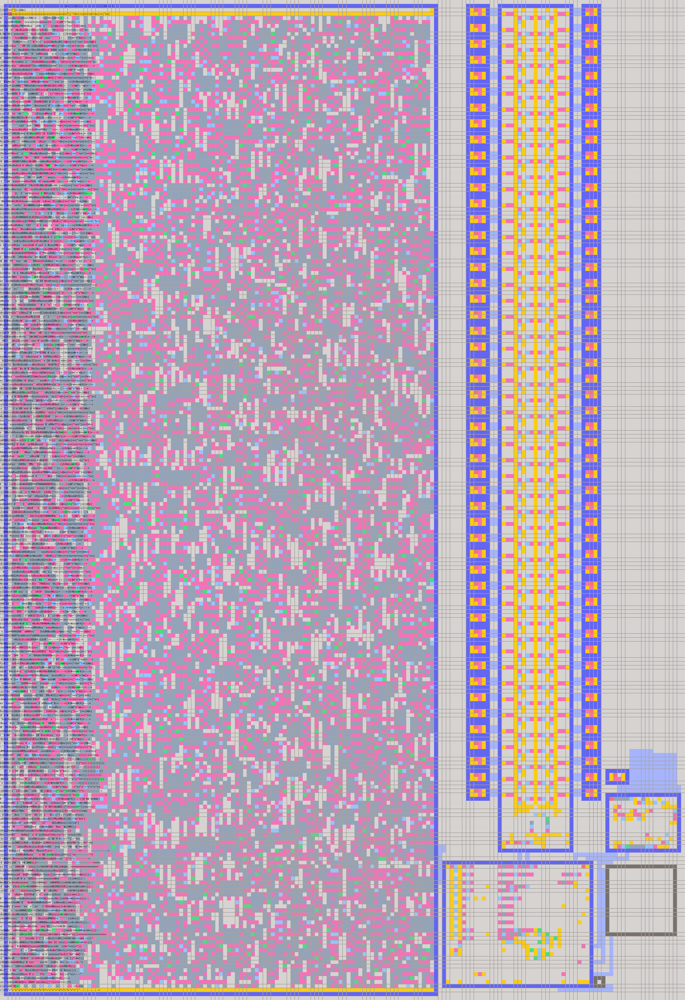
